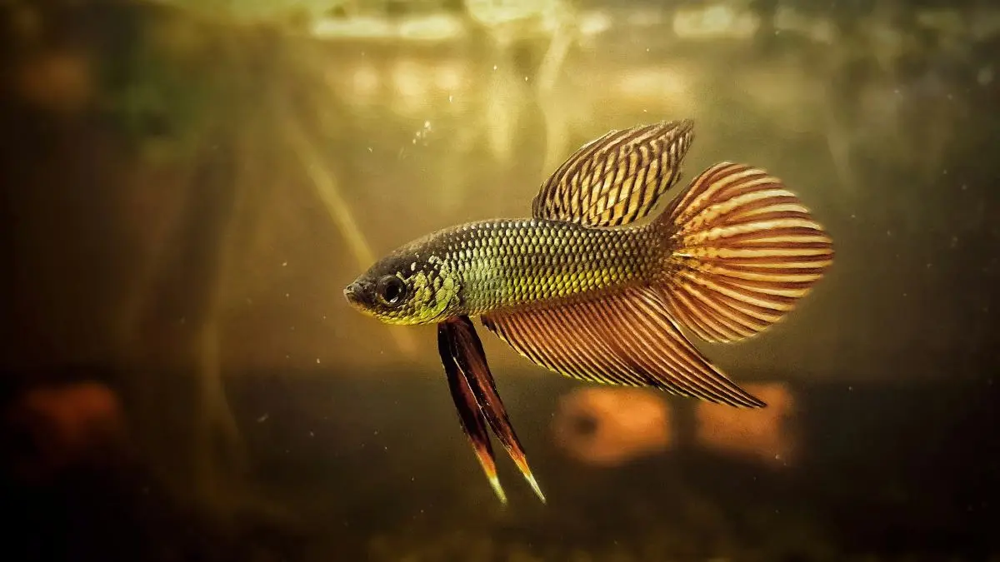

## Sebaran Geografis dan Habitat
Ikan cupang memiliki banyak varietas yang tersebar di wilayah tropis dengan suhu 24°C hingga 30°C, mencakup Thailand, Indonesia, Malaysia, Vietnam, dan sebagian China. Mereka juga ditemukan di Semenanjung Melayu serta menyeberang Selat Malaka hingga ke Sumatra, yang kemungkinan besar terjadi karena introduksi oleh manusia.

Di alam liar, ikan cupang umumnya hidup di perairan yang bergerak lambat dan beroksigen rendah, seperti: dataran banjir, saluran irigasi, sawah, kolam, sungai berarus lambat, rawa-rawa,sungai sedang hingga besar (Taki, 1978; Rainboth, 1996; IBC, 2019).

## Kemampuan Adaptasi dan Pola Makan
Ikan cupang tergolong dalam kelompok ikan anabantoid, yang memiliki organ labirin seperti paru-paru, memungkinkan mereka menghirup udara langsung dari permukaan air. Kemampuan ini membuat mereka dapat bertahan di perairan dengan kadar oksigen rendah, lebih mudah dipelihara dalam wadah kecil, serta lebih praktis untuk pengiriman dan transportasi dibandingkan ikan tropis lainnya.

Di alam liar, ikan cupang memangsa:🦟 Zooplankton, 🐛 Larva nyamuk, 🦗 Serangga kecil (Rainboth, 1996).

Sedangkan dalam pemeliharaan di akuarium, mereka bisa diberi pakan seperti:🦐 Moina (kutu air),🦐 Artemia (brine shrimp),🐟 Pelet ikan,🥚 Tahu telur.

Umumnya, ikan cupang memiliki masa hidup sekitar dua tahun, menurut penelitian Hugg (1996) dan laporan dari para penjual.

## Ciri Fisik dan Perilaku
Ciri khas ikan cupang liar secara garis besar dapat disebutkan sebagai berikut:
- Warna tubuh hitam atau hijau gelap
- Sirip pendek dan sederhana

Sementara untuk ikan cupang hasil budidaya, pada umumnya memiliki ciri khas sebagai berikut:
- Jantan memiliki warna cerah dengan sirip panjang dan menjuntai
- Betina cenderung memiliki warna pucat dengan sirip lebih kecil dan sederhana

Kemudian, keduanya (baik cupang alam maupun cupang hasil budidaya) memiliki sifat perlilaku berikut:
- Ikan cupang jantan sangat agresif dan teritorial, sehingga tidak disarankan memeliharanya dalam wadah kecil bersama pejantan lain, karena mereka akan saling menyerang (Riehl & Baensch, 1991).
- Ikan cupang betina dapat hidup bersama dalam wadah yang lebih besar tanpa konflik.
- Jantan dan betina dapat disatukan sementara untuk pemijahan, tetapi hanya satu betina yang boleh dimasukkan ke dalam akuarium pemijahan berkapasitas 20-30 liter.

## Reproduksi dan Konservasi

- Jantan membangun sarang gelembung di permukaan air, biasanya di bawah daun tanaman, untuk menarik betina.
- Setelah proses pemijahan, telur akan ditempatkan dalam sarang gelembung dan jantan akan mengusir betina serta menjaga telur hingga menetas.
- Jika betina tetap berada dalam akuarium terlalu lama, ia akan memakan telur yang telah dikeluarkan.

Benar bahwa budidaya komersial Ikan Cupang berkembang pesat, namun tahukah kamu bahwa populasinya semakin menurun di alam liar. Betta splendens telah dikategorikan sebagai spesies rentan oleh International Union for Conservation of Nature (IUCN) (Vidthayanon, 2011). Ancaman utama bagi populasi ikan cupang di alam liar meliputi:

 - Degradasi habitat dan polusi, terutama di Thailand bagian tengah, di mana sebagian besar habitat asli telah beralih menjadi lahan pertanian intensif dan kawasan perkotaan.
 - Lepasnya ikan budidaya ke alam liar, yang menyebabkan erosi genetik (IUCN, 2011).

Para penggemar ikan cupang berharap bahwa status nasional sebagai ikan khas Thailand dapat mendorong upaya konservasi yang lebih kuat.