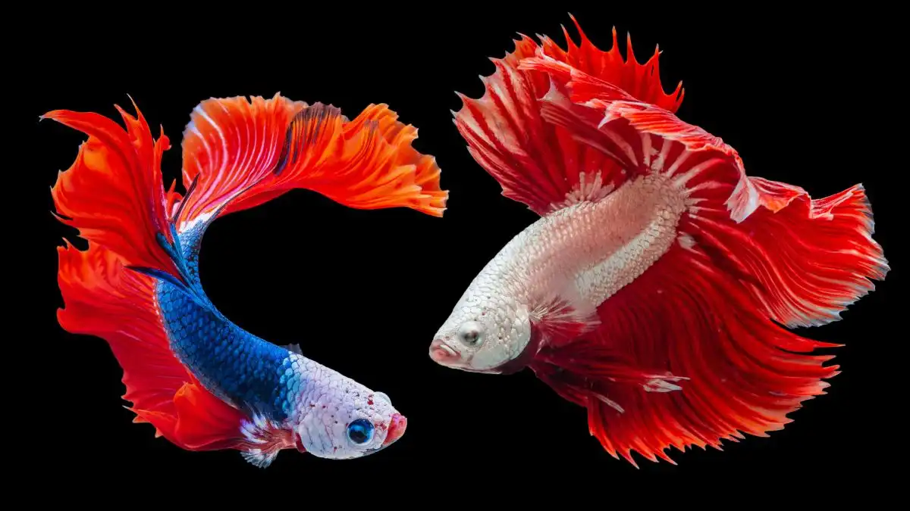

Berangkat dari sejarah budaya, dalam perkembangannya Ikan Cupang memberikan pengaruhnya juga pada perkembangan seni, dan dampak secara ekonomi. Kita bisa melihat contohnya di Thailand. Begitu besarnya support pemerintah Thailand pada produk pertanian, perikanan secara umum, dan secara khusus pada ikan kecil ini. Sampai puncaknya, Cupang dinobatkan sebagai Hewan Air Nasional Thailand (*Thailand’s National Aquatic Animal*), pada 5 Februari 2019 oleh Departemen Perikanan, di bawah Kementrian Pertanian dan Koperasi Thailand.

Di sini ([BettaPlus.com](https://bettaplus.com)) saya akan sering merujuk pada kemajuan industri aquaculture di Thailand, karena memang patut kita akui, negeri tersebut patut menjadi rujukan perkembangan maupun trend budidaya Ikan Cupang ini. Di Indonesia sendiri, sampai hari ini, kita dengan mudah melihat bahwa kemunculan 'trend baru' di dunia hobi cupang, selalu didahului dengan kehadiran varietas baru Ikan Cupang yang mulanya dikembangkan di Negeri Gajah Putih itu.

Sebagian besar penghobi pasti akan mengamini bagaimana trend 'giant betta fish', dumbo (big ear), marble, mulanya berkembang.

## Dampak Ekonomi dan Seni Kreatif
Keindahan unik ikan cupang juga menginspirasi berbagai karya seni dan produk kreatif, seperti fotografi, lukisan, patung, anyaman, desain grafis 3D, furnitur, kosmetik, dan fashion. Hal ini turut berkontribusi pada peningkatan popularitas ikan cupang di seluruh dunia.

## Industri Ikan Hias Thailand yang Terus Berkembang
Produksi ikan hias di Thailand terus tumbuh pesat berkat sumber daya alam yang melimpah dan pengalaman tradisional dalam budidaya ikan. Thailand merupakan salah satu eksportir ikan hias terkemuka di dunia (Dey, 2016). Selama bertahun-tahun, ikan cupang menjadi hewan air yang paling banyak diekspor dengan nilai ekonomi tertinggi.

Pada tahun 2018, volume ekspor ikan cupang mencapai 22,82 juta ekor dengan total nilai sekitar USD 5,55 juta. Sebelum ikan ini ditetapkan sebagai Hewan Air Nasional Thailand, permintaan pasar baik domestik maupun internasional sudah sangat tinggi.

Rata-rata ekspor tahunan ikan cupang antara tahun 2014 hingga 2018 adalah 23,92 juta ekor dengan nilai sekitar USD 4,29 juta. Meskipun pada 2018 volume ekspor menurun tajam, pendapatan justru meningkat signifikan menjadi USD 5,55 juta, yang merupakan pendapatan tertinggi dalam periode lima tahun tersebut. Kenaikan popularitas dan nilai ikan cupang di pasar global ini didukung oleh strategi pemasaran online yang efektif, terutama melalui media sosial, yang mulai diterapkan oleh peternak setelah mengikuti pelatihan pengembangan kapasitas dari Departemen Perikanan Thailand (DOF) selama 2013-2016.

## Pasar dan Harga Ikan Cupang di Berbagai Negara
Harga dan pasar ikan cupang sangat bervariasi tergantung pada karakteristik dan kualitasnya:
  - Amerika Serikat & Eropa → Umumnya dibeli sebagai ikan hias peliharaan.
  - Timur Tengah → Banyak dibeli sebagai hadiah dalam acara spesial.
  - Negara Asia → Lebih memilih ikan cupang berkualitas tinggi untuk kontes ikan hias.
  - Pedagang grosir → Membeli dalam jumlah besar dan dijual kembali dengan harga lebih tinggi.

Lima negara tujuan ekspor ikan cupang terbesar pada 2018 berdasarkan nilai ekonomi adalah: Amerika Serikat, China, Prancis, Iran, dan Singapura. Meskipun volume ekspor ke Prancis adalah yang terendah di antara lima besar negara importir, harga ikan cupang di sana menjadi yang termahal, sekitar USD 0,50 per ekor, karena kualitas tinggi dan biaya logistik yang mahal.

## Tren Penjualan dan Rekor Harga Tertinggi
Di kalangan para penghobi model penjualan komoditi Cupang masih didominasi oleh transaksi melalui pembudidaya, toko ikan lokal. Hal ini menjadi pilihan utama karena pelanggan lebih yakin soal kualitas ikan yang dibelinya dengan melihat dan membeli ikan cupang secara langsung. Ini yang kami dapati juga di Farm BettaPlus, pelanggan lebih puas saat memilih sendiri langsung dari akuarium soliter yang berjajar memanjang di rak-rak perawatan.

Sementara itu, model pemasaran online perlahan juga tak kalah ramai. Model pemasaran ini telah memperluas jangkauan pasar domestik dan internasional, melalui lelang ikan di situs web dan media sosial. Saya pada mulanya termasuk yang cukup aktif mengikuti bidding yang diselenggarakan di page hobiis di Facebook misalnya. Bahkan sampai saat ini, hasil pencarian untuk topik jual beli cupang di mesin pencari, didominiasi oleh listing penjualan Cupang melalui market place. Buktikan saja.

Bicara soal harga, harga ikan cupang bervariasi berdasarkan warna dan bentuk sirip, mulai dari kurang dari satu dolar hingga ribuan dolar. Rekor ikan cupang termahal sejauh ini adalah ikan dengan warna bendera nasional Thailand, yang terjual seharga USD 1.530 melalui lelang online (Bangkok Post, 2016).

## Dukungan Pemerintah Thailand untuk Peternak
Industri ikan cupang telah menghasilkan jutaan dolar bagi Thailand selama bertahun-tahun. Namun, meskipun perdagangan internasionalnya menguntungkan, banyak peternak lokal masih menghadapi kesulitan ekonomi karena kurangnya pemahaman dan keterampilan dalam pemasaran.

Oleh sebab itulah kemudian Pemerintah Thailand melalui Departement Perikannannya (DOF) di bawah Kementerian Pertanian dan Koperasi Thailand memberikan bantuan pengembangan kapasitas bagi para peternak Cupang, di antaranya berupa program:
  - Bantuan keuangan dan dukungan logistik
  - Pelatihan strategi pemasaran online yang efektif, seperti promosi melalui sosial media

Baru-baru ini, Kantor Promosi Usaha Kecil dan Menengah (OSMEP) Thailand juga berkomitmen untuk memberikan dukungan penuh bagi peternak ikan cupang rumahan. Tujuannya adalah membantu mereka mencapai kehidupan berkelanjutan dengan meningkatkan daya saing di pasar internasional serta menambah nilai ekonomi dari produk budidaya rumahan.